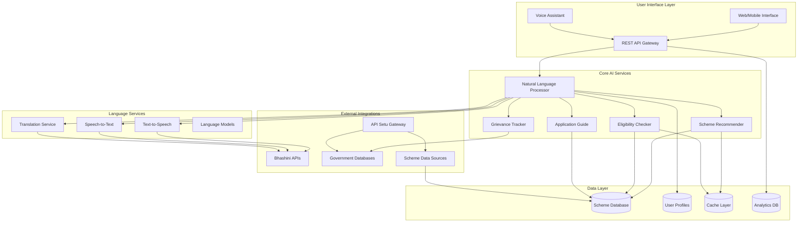

# Design Document: JAN-SAHAYAK AI

## Overview

JAN-SAHAYAK AI is a multilingual, voice-enabled AI assistant designed to democratize access to government schemes and public services across India. The system leverages India's existing digital infrastructure including Bhashini for language processing and API Setu for government data access, while providing an intuitive conversational interface that works across text and voice modalities.

The architecture follows a microservices approach with clear separation of concerns, enabling scalability, maintainability, and integration with India's digital public infrastructure. The system is designed to handle the linguistic diversity of India while maintaining high performance and reliability for nationwide deployment.

## Architecture

### High-Level Architecture



### Service Architecture

The system employs a microservices architecture with the following key principles:

1. **API-First Design**: All services expose RESTful APIs for loose coupling
2. **Language Agnostic Processing**: Core logic separated from language-specific processing
3. **Caching Strategy**: Multi-layer caching for performance optimization
4. **Fault Tolerance**: Circuit breakers and graceful degradation
5. **Horizontal Scalability**: Stateless services with load balancing

## Components and Interfaces

### 1. Natural Language Processor (NLP)

**Purpose**: Central orchestrator for understanding user intent and managing conversation flow.

**Key Responsibilities**:
- Intent classification and entity extraction
- Context management across conversation turns
- Language detection and routing
- Response generation coordination

**Interfaces**:
```typescript
interface NLPService {
  processQuery(input: UserInput): Promise<ProcessedQuery>
  detectLanguage(text: string): Promise<LanguageCode>
  extractEntities(text: string, language: LanguageCode): Promise<EntityMap>
  generateResponse(intent: Intent, context: ConversationContext): Promise<Response>
}

interface UserInput {
  text?: string
  audio?: AudioBuffer
  userId: string
  sessionId: string
  language?: LanguageCode
}

interface ProcessedQuery {
  intent: Intent
  entities: EntityMap
  confidence: number
  language: LanguageCode
  requiresFollowup: boolean
}
```

### 2. Scheme Recommender

**Purpose**: AI-powered recommendation engine for matching users with relevant government schemes.

**Key Responsibilities**:
- Profile-based scheme matching
- Ranking algorithms for scheme prioritization
- Continuous learning from user interactions
- Regional and demographic filtering

**Interfaces**:
```typescript
interface SchemeRecommender {
  recommendSchemes(profile: UserProfile, limit?: number): Promise<SchemeRecommendation[]>
  searchSchemes(query: SearchQuery): Promise<SchemeResult[]>
  updateUserFeedback(userId: string, schemeId: string, feedback: Feedback): Promise<void>
}

interface UserProfile {
  demographics: Demographics
  location: Location
  occupation: string
  income?: IncomeRange
  familySize: number
  preferences: string[]
}

interface SchemeRecommendation {
  scheme: GovernmentScheme
  relevanceScore: number
  eligibilityStatus: EligibilityStatus
  reasoning: string[]
}
```

### 3. Eligibility Checker

**Purpose**: Rule-based and ML-powered eligibility verification system.

**Key Responsibilities**:
- Criteria validation against scheme requirements
- Missing information identification
- Alternative scheme suggestions
- Eligibility explanation generation

**Interfaces**:
```typescript
interface EligibilityChecker {
  checkEligibility(profile: UserProfile, schemeId: string): Promise<EligibilityResult>
  validateCriteria(criteria: EligibilityCriteria, profile: UserProfile): Promise<ValidationResult>
  suggestAlternatives(profile: UserProfile, rejectedScheme: string): Promise<SchemeRecommendation[]>
}

interface EligibilityResult {
  eligible: boolean
  confidence: number
  missingCriteria: string[]
  satisfiedCriteria: string[]
  explanation: string
  alternatives?: GovernmentScheme[]
}
```

### 4. Application Guide

**Purpose**: Step-by-step guidance system for scheme applications.

**Key Responsibilities**:
- Process breakdown and sequencing
- Document requirement listing
- Portal navigation assistance
- Progress tracking

**Interfaces**:
```typescript
interface ApplicationGuide {
  getApplicationSteps(schemeId: string): Promise<ApplicationStep[]>
  getRequiredDocuments(schemeId: string, profile: UserProfile): Promise<DocumentRequirement[]>
  trackProgress(userId: string, applicationId: string): Promise<ApplicationProgress>
}

interface ApplicationStep {
  stepNumber: number
  title: string
  description: string
  requiredDocuments: string[]
  estimatedTime: number
  portalUrl?: string
  helpText: string[]
}
```

### 5. Grievance Tracker

**Purpose**: Public grievance guidance and tracking system.

**Key Responsibilities**:
- Grievance categorization and routing
- Department identification
- Status tracking assistance
- Escalation guidance

**Interfaces**:
```typescript
interface GrievanceTracker {
  categorizeGrievance(description: string): Promise<GrievanceCategory>
  getFilingInstructions(category: GrievanceCategory, location: Location): Promise<FilingInstructions>
  trackGrievanceStatus(grievanceId: string): Promise<GrievanceStatus>
}

interface GrievanceCategory {
  category: string
  department: string
  priority: Priority
  expectedResolutionTime: number
}
```

### 6. Language Services

**Purpose**: Multilingual processing using Bhashini and custom models.

**Key Responsibilities**:
- Speech-to-text conversion
- Text-to-speech synthesis
- Real-time translation
- Language model inference

**Integration with Bhashini**:
```typescript
interface LanguageService {
  speechToText(audio: AudioBuffer, language: LanguageCode): Promise<string>
  textToSpeech(text: string, language: LanguageCode): Promise<AudioBuffer>
  translate(text: string, from: LanguageCode, to: LanguageCode): Promise<string>
}

// Bhashini API Integration
interface BhashiniClient {
  pipeline: {
    compute: (request: PipelineRequest) => Promise<PipelineResponse>
  }
  config: {
    getConfig: (request: ConfigRequest) => Promise<ConfigResponse>
  }
}
```

## Data Models

### Core Entities

```typescript
interface GovernmentScheme {
  id: string
  name: string
  description: string
  category: SchemeCategory
  eligibilityCriteria: EligibilityCriteria
  benefits: Benefit[]
  applicationProcess: ApplicationProcess
  documents: DocumentRequirement[]
  department: string
  state?: string
  lastUpdated: Date
  isActive: boolean
}

interface EligibilityCriteria {
  ageRange?: { min: number; max: number }
  incomeRange?: { min: number; max: number }
  occupation?: string[]
  location?: LocationCriteria
  gender?: Gender
  category?: SocialCategory[]
  customRules: Rule[]
}

interface UserProfile {
  userId: string
  demographics: Demographics
  location: Location
  preferences: UserPreferences
  interactionHistory: Interaction[]
  createdAt: Date
  lastActive: Date
}

interface Demographics {
  age: number
  gender: Gender
  occupation: string
  income?: number
  education: EducationLevel
  socialCategory?: SocialCategory
  familySize: number
  maritalStatus: MaritalStatus
}

interface ConversationContext {
  sessionId: string
  userId: string
  language: LanguageCode
  currentIntent: Intent
  entities: EntityMap
  conversationHistory: Message[]
  userProfile?: UserProfile
}
```

### Database Schema Design

**Scheme Database (PostgreSQL)**:
- Optimized for complex eligibility queries
- Full-text search capabilities
- Audit trail for scheme updates
- Indexing on common filter criteria

**User Profiles (MongoDB)**:
- Flexible schema for diverse user data
- Privacy-compliant data storage
- Session management
- Interaction analytics

**Cache Layer (Redis)**:
- Frequently accessed scheme data
- User session state
- API response caching
- Rate limiting counters

## Error Handling

### Error Categories and Strategies

1. **Language Processing Errors**
   - Fallback to simpler language models
   - Request clarification from user
   - Offer alternative input methods

2. **Data Availability Errors**
   - Graceful degradation with cached data
   - Clear communication about limitations
   - Alternative information sources

3. **External API Failures**
   - Circuit breaker patterns
   - Retry mechanisms with exponential backoff
   - Fallback to local processing where possible

4. **User Input Errors**
   - Contextual error messages
   - Guided correction suggestions
   - Progressive disclosure of requirements

### Error Response Format

```typescript
interface ErrorResponse {
  error: {
    code: string
    message: string
    details?: any
    suggestions?: string[]
    fallbackOptions?: FallbackOption[]
  }
  requestId: string
  timestamp: Date
}

interface FallbackOption {
  type: 'retry' | 'alternative' | 'manual'
  description: string
  action?: string
}
```

## Testing Strategy

### Dual Testing Approach

The system requires both unit testing and property-based testing to ensure comprehensive coverage:

**Unit Testing Focus**:
- API endpoint validation
- Database operations
- External service integrations
- Error handling scenarios
- Language-specific edge cases

**Property-Based Testing Focus**:
- Universal correctness properties
- Cross-language consistency
- Data integrity across operations
- Performance characteristics
- Security properties

### Property-Based Testing Configuration

- **Framework**: Use fast-check for TypeScript/JavaScript components
- **Iterations**: Minimum 100 iterations per property test
- **Test Tagging**: Each test references design document properties
- **Tag Format**: `Feature: jan-sahayak-ai, Property {number}: {property_text}`

### Testing Infrastructure

- **Continuous Integration**: Automated testing on every commit
- **Load Testing**: Simulate nationwide usage patterns
- **Language Testing**: Automated testing across all supported languages
- **Integration Testing**: End-to-end user journey validation
- **Security Testing**: Penetration testing and vulnerability assessment

## Correctness Properties

*A property is a characteristic or behavior that should hold true across all valid executions of a system—essentially, a formal statement about what the system should do. Properties serve as the bridge between human-readable specifications and machine-verifiable correctness guarantees.*

### Property 1: Multilingual Language Consistency
*For any* user query in a supported Indian language (Hindi, English, or regional languages), the system should process the intent accurately and respond in the same language as the input, handling dialectal variations appropriately.
**Validates: Requirements 1.1, 1.3, 1.5**

### Property 2: Speech Processing Accuracy
*For any* audio input in supported languages, the Voice_Interface should convert speech to text with at least 90% accuracy, even in the presence of background noise, and provide natural-sounding text-to-speech output.
**Validates: Requirements 1.2, 5.1, 5.2, 5.3**

### Property 3: Scheme Recommendation Accuracy
*For any* user profile with demographic information, the Scheme_Recommender should identify relevant schemes with at least 85% accuracy, properly rank them by benefit value and application ease, and filter correctly by category when requested.
**Validates: Requirements 2.1, 2.2, 2.3, 2.4**

### Property 4: Eligibility Validation Correctness
*For any* combination of user profile and government scheme, the Eligibility_Checker should return accurate yes/no determinations, perform correct calculations for complex criteria, and provide clear explanations when eligibility fails.
**Validates: Requirements 3.1, 3.2, 3.3**

### Property 5: Application Guidance Completeness
*For any* government scheme, the Application_Guide should provide sequential, understandable steps with complete document requirements, valid portal links, and helpful troubleshooting information when difficulties arise.
**Validates: Requirements 4.1, 4.2, 4.3, 4.4, 4.5**

### Property 6: Accessibility Support
*For any* user with accessibility needs, the system should provide alternative input methods while maintaining core functionality, including voice activation and support for users with speech difficulties.
**Validates: Requirements 5.4, 5.5**

### Property 7: Grievance Processing Accuracy
*For any* grievance description, the Grievance_Tracker should correctly identify the appropriate department, provide accurate filing instructions, enable status tracking, and offer location-specific guidance based on the user's state.
**Validates: Requirements 6.1, 6.2, 6.3, 6.4, 6.5**

### Property 8: Offline Functionality Preservation
*For any* connectivity condition (poor, limited bandwidth, or offline), the system should maintain core functionality through cached responses, local data storage, and appropriate adaptation of response formats while synchronizing when connectivity is restored.
**Validates: Requirements 7.1, 7.2, 7.3, 7.4, 7.5**

### Property 9: Data Privacy Protection
*For any* personal information provided by users, the system should encrypt and store data according to Indian regulations, anonymize interaction data, never share data without consent, and completely remove data within 30 days when deletion is requested.
**Validates: Requirements 8.1, 8.2, 8.3, 8.4**

### Property 10: Continuous Learning and Adaptation
*For any* user interaction or system feedback, the system should collect anonymized data for improvement, automatically incorporate new scheme information, flag incorrect content for review, and adapt to changing language patterns over time.
**Validates: Requirements 9.1, 9.2, 9.3, 9.4, 9.5**

### Property 11: Performance and Scalability
*For any* system load condition, the system should respond within specified time limits (3 seconds for text, 5 seconds for voice), handle at least 10,000 concurrent sessions, maintain 99.5% uptime, and optimize complex queries through efficient indexing and caching.
**Validates: Requirements 10.1, 10.2, 10.3, 10.4, 10.5**

### Property 12: Data Synchronization Consistency
*For any* scheme information update, the system should reflect changes in recommendations within 24 hours and update eligibility validation logic to match current government policies.
**Validates: Requirements 2.5, 3.5**

### Property 13: Graceful Information Handling
*For any* incomplete user profile, the Eligibility_Checker should request only essential missing details and handle partial information gracefully without system failure.
**Validates: Requirements 3.4**